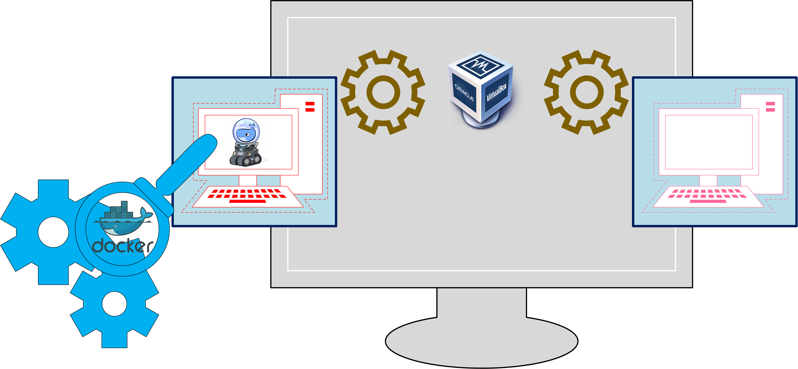

# What is Docker?
It is a self contained sealed unit of software containing everything required to run the code. That is, OS and batteries included.

## What can it do?
- client program called **Docker**.
- server program that can manage Linux system.
- a program that builds containers from code.

## What happens when you install Docker?

You install softwares: [**Docker**](https://www.docker.com/), [**docker-machine**](https://github.com/docker/machine) and [**VirtualBox**](https://www.virtualbox.org/). VirtualBox manages virtual machines, among which is docker-machine, inside it is the Docker program.

